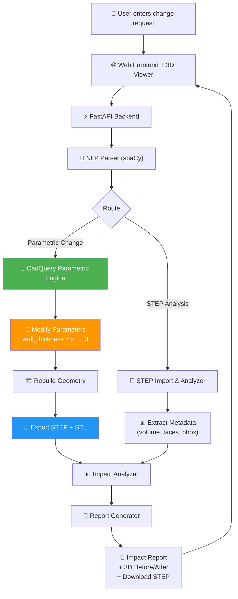

# CAD Modification Methods — Complete Research & Comparison

## The Core Problem

You want the system to **actually modify a CAD model** when a user types "Reduce wall thickness of Housing by 2mm". There are fundamentally **two different strategies**:

| Strategy | How it works | Analogy |
|----------|-------------|---------|
| **Strategy A: Modify existing files** | Take a .stp file → find the right geometry → surgically modify it | Like editing a compiled .exe — possible but painful |
| **Strategy B: Define parts as code** | Define the gearbox IN Python code with variables → change the variable → regenerate | Like editing source code and recompiling — clean and easy |

---

## All 6 Methods I Researched

### Method 1: STEP File Manipulation (CadQuery/PythonOCC)

**What it is:** Import a downloaded .stp file → identify faces → offset/modify → export new .stp

```python
import cadquery as cq
part = cq.importers.importStep("housing.stp")
modified = part.faces(">Z").shell(-2.0)  # Try to shell it
cq.exporters.export(modified, "housing_modified.stp")
```

| Aspect | Rating |
|--------|--------|
| **Difficulty** | 🔴 Hard — STEP files are "dumb geometry", no named parameters |
| **Reliability** | 🟡 Medium — `shell()` and `offset` fail often on complex parts |
| **Impressiveness** | 🟢 High — "we modify real downloaded CAD files!" |
| **Works with GrabCAD files** | ✅ Yes |
| **Risk** | Geometry operations can fail silently or crash on complex parts |

**Verdict:** Impressive but fragile. Great for simple parts, unreliable for complex ones.

---

### Method 2: CadQuery Parametric (Code-as-CAD) ⭐ RECOMMENDED

**What it is:** Define the gearbox parts IN Python code using variables. To "change wall thickness", you literally change `wall_thickness = 5` to `wall_thickness = 3`.

```python
import cadquery as cq

# Parameters — THE SYSTEM MODIFIES THESE
wall_thickness = 5      # <-- NLP changes this to 3
housing_length = 100
housing_width = 60
housing_height = 80

# Build the housing programmatically
housing = (
    cq.Workplane("XY")
    .box(housing_length, housing_width, housing_height)
    .faces(">Z")
    .shell(-wall_thickness)           # Hollow it out
    .faces(">Z")
    .workplane()
    .hole(25)                         # Bearing bore
)

# Export to STEP (opens in ANY CAD software)
cq.exporters.export(housing, "housing.step")
```

**To modify**: Just change `wall_thickness = 5` → `wall_thickness = 3` and re-run. That's it!

| Aspect | Rating |
|--------|--------|
| **Difficulty** | 🟢 Easy — it's just Python variables! |
| **Reliability** | 🟢 High — you control the geometry, so it always works |
| **Impressiveness** | 🟢 Very High — "our system defines AND modifies CAD models from NLP!" |
| **Works with GrabCAD files** | ⚠️ No — you define your own parts in code |
| **Risk** | Very low — predictable and deterministic |

**Verdict:** The most reliable and demonstrable approach. You "own" the model definition.

---

### Method 3: OpenSCAD + SolidPython

**What it is:** Define parts in Python → generate `.scad` files → OpenSCAD renders to STL/STEP

```python
from solid2 import *

wall_thickness = 5
housing = cube([100, 60, 80]) - cube([100-wall_thickness*2, 60-wall_thickness*2, 80-wall_thickness])

scad_render_to_file(housing, "housing.scad")
# Then: openscad -o housing.stl housing.scad
```

| Aspect | Rating |
|--------|--------|
| **Difficulty** | 🟢 Easy — very simple syntax |
| **Reliability** | 🟢 High — deterministic CSG operations |
| **Impressiveness** | 🟡 Medium — OpenSCAD looks "hobby-ish" to judges |
| **STEP export** | 🟡 Limited — newer versions only, quality varies |
| **Requires** | OpenSCAD desktop software installed (extra dependency) |

**Verdict:** Simple but not as professional. Requires installing OpenSCAD separately. No good STEP export.

---

### Method 4: FreeCAD Headless Python

**What it is:** Use FreeCAD as a headless Python engine. Import STEP, modify parametrically, export.

```python
import FreeCAD
doc = FreeCAD.open("housing.step")
obj = doc.getObject("Housing")
obj.Length = 50.0
doc.recompute()
Part.export([obj], "housing_modified.step")
```

| Aspect | Rating |
|--------|--------|
| **Difficulty** | 🟡 Medium — FreeCAD API is large and sometimes confusing |
| **Reliability** | 🟡 Medium — depends on how FreeCAD interprets imported STEP |
| **Impressiveness** | 🟢 High — "uses professional CAD kernel" |
| **Requires** | FreeCAD installed (700MB+), tricky Python path setup |
| **Risk** | Setting up FreeCAD as a Python library is notoriously finicky on Windows |

**Verdict:** Powerful but heavy. Setting up FreeCAD headless on Windows is a headache.

---

### Method 5: OnShape Cloud API

**What it is:** Use OnShape's free browser CAD + REST API to modify models remotely.

| Aspect | Rating |
|--------|--------|
| **Difficulty** | 🟡 Medium — REST API is well documented |
| **Reliability** | 🟢 High — OnShape handles all geometry |
| **Impressiveness** | 🟢 High — cloud-native approach |
| **Requires** | Internet connection, OnShape account, API key |
| **Risk** | Depends on external service. Rate limits. Can't work offline. |

**Verdict:** Great concept but adds external dependency. Not ideal for a self-contained demo.

---

### Method 6: JSCAD (JavaScript CAD in Browser)

**What it is:** Parametric CAD that runs entirely in the browser using JavaScript.

| Aspect | Rating |
|--------|--------|
| **Difficulty** | 🟡 Medium — need to learn JSCAD API |
| **Reliability** | 🟢 High — runs in browser, no installation |
| **Impressiveness** | 🟢 High — everything runs in the browser! |
| **STEP export** | 🔴 No — only STL/3MF |
| **Risk** | STL-only export. No engineering-grade precision. |

**Verdict:** Cool tech but no STEP export and not Python-based. Doesn't fit our backend architecture.

---

## ⭐ THE COMPARISON MATRIX

| Criteria | STEP Manipulation | CadQuery Parametric | OpenSCAD | FreeCAD | OnShape | JSCAD |
|----------|:-:|:-:|:-:|:-:|:-:|:-:|
| **Ease of implementation** | ⭐⭐ | ⭐⭐⭐⭐⭐ | ⭐⭐⭐⭐ | ⭐⭐ | ⭐⭐⭐ | ⭐⭐⭐ |
| **Reliability** | ⭐⭐ | ⭐⭐⭐⭐⭐ | ⭐⭐⭐⭐ | ⭐⭐⭐ | ⭐⭐⭐⭐ | ⭐⭐⭐⭐ |
| **Demo impressiveness** | ⭐⭐⭐⭐ | ⭐⭐⭐⭐⭐ | ⭐⭐⭐ | ⭐⭐⭐⭐ | ⭐⭐⭐⭐ | ⭐⭐⭐ |
| **Works offline** | ✅ | ✅ | ✅ | ✅ | ❌ | ✅ |
| **Produces STEP files** | ✅ | ✅ | ⚠️ | ✅ | ✅ | ❌ |
| **No extra software** | ✅ | ✅ | ❌ | ❌ | ❌ | ✅ |
| **Handles your GrabCAD files** | ✅ | ❌* | ❌ | ✅ | ⚠️ | ❌ |
| **Python-native** | ✅ | ✅ | ⚠️ | ⚠️ | ✅ | ❌ |

*\* But you can ALSO import/analyze GrabCAD STEP files with CadQuery for metadata extraction*

---

## 🏆 MY RECOMMENDATION: Hybrid CadQuery Approach

### The Winner: CadQuery Parametric + STEP Import (Best of Both Worlds)

Here's the strategy:

### Part A: Define Your Gearbox as Code (Primary Path)

You define the gearbox assembly **in Python** using CadQuery with named parameters. This is the model the NLP system modifies.

```python
# This IS the CAD model — defined as code
class GearboxModel:
    # Parameters (NLP system modifies these)
    housing_wall_thickness = 5.0    # mm
    housing_length = 120.0          # mm
    housing_width = 80.0            # mm
    housing_height = 90.0           # mm
    shaft_diameter = 25.0           # mm
    gear_a_teeth = 20
    gear_b_teeth = 40
    gear_module = 2.5
    bearing_inner_dia = 25.0        # mm
    bearing_outer_dia = 52.0        # mm
    cover_thickness = 3.0           # mm
    bolt_size = 6.0                 # mm (M6)
    
    def build_housing(self):
        return (
            cq.Workplane("XY")
            .box(self.housing_length, self.housing_width, self.housing_height)
            .faces(">Z")
            .shell(-self.housing_wall_thickness)
            .faces(">X")
            .workplane()
            .hole(self.shaft_diameter + 1)  # Shaft bore
        )
```

**When user says "Reduce wall thickness of Housing by 2mm":**
1. NLP extracts: `target=housing, parameter=wall_thickness, action=reduce, value=2`
2. System does: `model.housing_wall_thickness = 5.0 - 2.0  # Now 3.0`
3. System runs: `model.build_housing()` → new geometry generated
4. System exports: both STEP and STL files
5. 3D viewer shows before/after

### Part B: Import GrabCAD STEP for Comparison/Analysis (Secondary Path)

You can ALSO upload your GrabCAD STEP files. The system will:
- Parse them to extract metadata (volume, surface area, bounding box, face count)
- Show them in the 3D viewer alongside the parametric model
- Use them for visual comparison in the demo

> [!IMPORTANT]
> **This hybrid approach gives you TWO impressive demo paths:**
> 1. "Here's our parametric model that the system modifies in real-time" (reliable, always works)
> 2. "And here's a real GrabCAD STEP file we imported for comparison" (shows real-world applicability)

---

## Why This Is The Best Choice

### For Reliability
- Parametric CadQuery models are **deterministic** — they ALWAYS produce correct output
- No risk of geometry operations failing (which happens with STEP modification)
- You control every dimension, so every NLP command works predictably

### For Impressiveness
- "Our system defines models programmatically and modifies them from natural language"
- Before/after 3D comparison in the browser
- Downloads a real STEP file that opens in Fusion 360
- You can also show imported GrabCAD models

### For Simplicity
- It's just Python — no extra software to install
- `pip install cadquery` — that's it
- No API keys, no cloud, no FreeCAD setup headaches

### For Your Project Story
- "We took a code-first approach to CAD, inspired by Infrastructure-as-Code"
- "Our system combines NLP with parametric modeling to automate engineering changes"
- "The parametric approach means changes are always valid — unlike direct STEP editing which can produce invalid geometry"

---

## Updated Architecture (with Hybrid Approach)



---

## What About Your GrabCAD Files?

### You'll use them for:
1. **Visual reference** — show the "real" gearbox in your presentation alongside your parametric one
2. **STEP analysis demo** — upload a .stp file, system extracts part count, volumes, face counts
3. **Comparison** — "Here's the industry STEP file, and here's our parametric model that responds to NLP"

### You do NOT need them for:
- The actual modification pipeline (that uses your parametric CadQuery model)

---

## Hardware Requirements (Confirmed)

| Requirement | Details |
|-------------|---------|
| **CPU** | Any modern CPU (CadQuery uses OpenCASCADE on CPU) |
| **GPU** | Not needed (Three.js uses browser WebGL, works on anything) |
| **RAM** | 8GB minimum, 16GB comfortable |
| **Storage** | ~2GB for Python env + CadQuery + spaCy |
| **OS** | Windows 10/11 |
| **Cloud** | ❌ Not needed — everything runs locally |

**Your RTX 4060 laptop is more than enough. No cloud needed.**

---

## Open Questions

> [!IMPORTANT]
> 1. **Do you want me to proceed with this Hybrid CadQuery approach?**
>    - Primary: Parametric CadQuery model (reliable, NLP-driven)
>    - Secondary: STEP file import for analysis and comparison
>
> 2. **For the gearbox model, do you want me to match it to your specific GrabCAD download?**
>    - If so, can you share the name/link of the GrabCAD model you downloaded?
>    - Otherwise I'll design a standard gearbox assembly (Housing, Shafts, Gears, Bearings, Cover Plate)

